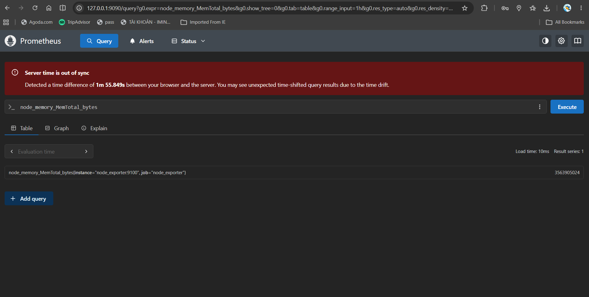
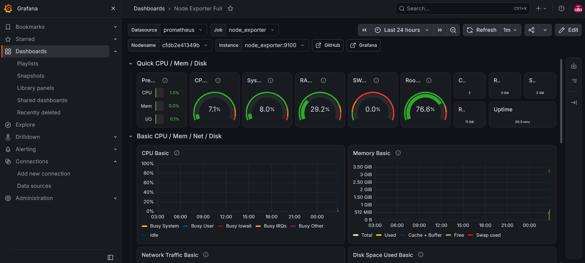

# Infrastructure Monitoring Lab with Prometheus & Grafana

[](https://opensource.org/licenses/MIT)
[](https://ubuntu.com/)
[](https://prometheus.io/)
[](https://grafana.com/)

> **A hands-on, production-style monitoring lab built from scratch for infrastructure observability training and portfolio demonstration.**

---

## 📌 Overview

This project represents a complete, self-contained monitoring laboratory designed to simulate a real-world production environment. As an aspiring DevOps/System Operations professional, I built this lab to bridge the gap between theoretical knowledge and practical implementation of modern observability stacks.

The infrastructure demonstrates competency across multiple critical domains:

- **Virtualization**: Orchestration of guest VMs using Oracle VirtualBox on a Windows host
- **Linux System Administration**: Headless Ubuntu Server 22.04 LTS management via SSH
- **Container Orchestration**: Docker Compose for multi-service application deployment
- **Monitoring & Observability**: End-to-end metrics collection, storage, and visualization pipeline
- **Networking**: Port forwarding, service exposure, and IPv4/IPv6 troubleshooting

---

## 🏗️ Architecture Overview

```text
                               PHYSICAL HOST (Windows 11)
                               ┌──────────────────────────────────┐
                               │  Hardware: Ryzen 7 6800H, 16GB  │
                               │  Terminal: PowerShell / SSH     │
                               │                                  │
                               │  ┌────────────────────────────┐ │
                               │  │    Oracle VM VirtualBox    │ │
                               │  │                            │ │
                               │  │  ┌──────────────────────┐ │ │
                               │  │  │   Ubuntu 22.04 VM    │ │ │
                               │  │  │  2 vCPUs | 4GB RAM  │ │ │
                               │  │  │  25GB Disk          │ │ │
                               │  │  │                      │ │ │
                               │  │  │  ┌───────────────┐  │ │ │
                               │  │  │  │ Docker Engine │  │ │ │
                               │  │  │  │  & Compose    │  │ │ │
                               │  │  │  └───────┬───────┘  │ │ │
                               │  │  │          │          │ │ │
                               │  │  │  ┌───────▼───────┐  │ │ │
                               │  │  │  │  Node       │  │ │ │
                               │  │  │  │  Exporter   │  │ │ │
                               │  │  │  │  :9100      │  │ │ │
                               │  │  │  └───────┬───────┘  │ │ │
                               │  │  │          │          │ │ │
                               │  │  │  ┌───────▼───────┐  │ │ │
                               │  │  │  │  Prometheus  │  │ │ │
                               │  │  │  │  :9090       │──┼─┼─┼─► Host:9090
                               │  │  │  └───────┬───────┘  │ │ │
                               │  │  │          │          │ │ │
                               │  │  │  ┌───────▼───────┐  │ │ │
                               │  │  │  │   Grafana    │  │ │ │
                               │  │  │  │   :3000      │──┼─┼─┼─► Host:3000
                               │  │  │  └───────────────┘  │ │ │
                               │  │  └──────────────────────┘ │ │
                               │  └────────────────────────────┘ │
                               └──────────────────────────────────┘
## Screenshots & Verification

### 1. Prometheus Targets


### 2. Grafana System Dashboard

